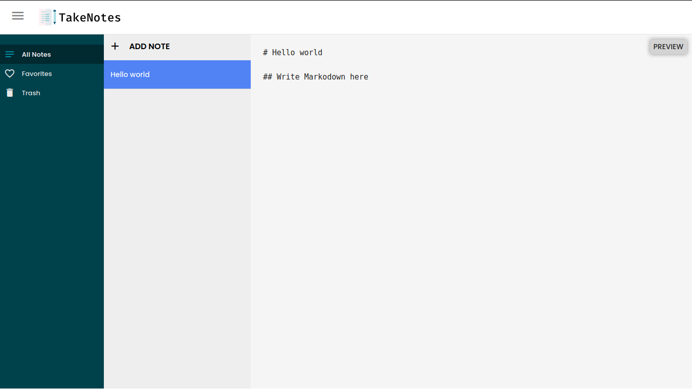

# <center> Take Notes </center>

> React note taking application made using react-hooks and Context API. Inspired from [take note](https://github.com/taniarascia/takenote) by [Tania Rascia](https://twitter.com/taniarascia).

### [Live preview](https://take-notes.netlify.app/)

[](https://app.netlify.com/sites/take-notes/deploys)



## Development

Clone this repository, and inside the project directory run

```sh
npm install
```

This will install all the required dependencies for the project. Inside the project directory you can then run

```sh
npm start
```

which will then run the project on developement mode. Open [http://localhost:3000](http://localhost:3000) to view it a Browser.

## Author

Shubham Battoo

- Twitter: [@Shubham_batt](https://twitter.com/Shubham_batt)
- Github: [@shubhambattoo](https://github.com/shubhambattoo)

## Contributing

Contributions, issues and feature requests are welcome!<br />
Feel free to check [issues page](https://github.com/shubhambattoo/react-take-notes/issues).

Give a ⭐️ if this project helped you!
